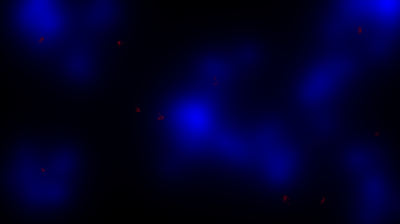

# Neuron Growth Simulation

Simulate axonal growth in a 2D cellular-automaton world.

## Latest Final Results

<table>
  <tr>
    <td></td>
  </tr>
</table>

## Usage

Run the simulation and update results:
```bash
./run_simulation.sh
```

## Environment

- conda environment: axon
- Required packages: see requirements.txt
