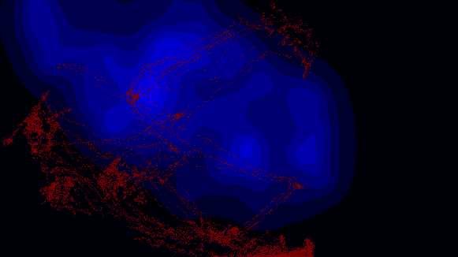

# Neuron Growth Simulation

Simulate axonal growth in a 2D cellular-automaton world. The repulsion area (blue-colored regions) are stochastically generated based on Mac desktop app locations, so that you can enjoy how neuron seeds interactively grow.


## Gallery

<table>
  <tr>
    <td></td>
    <td></td>
    <td></td>
  </tr>
  <tr>
    <td></td>
    <td></td>
    <td></td>
  </tr>
</table>

## Usage

Run the simulation and update results:
```bash
# conda create -n axon python=3.11 # for initial setup
# pip install -r requirements.txt # for initial setup
conda activate axon
./run_simulation.sh
```

## Environment

- OS environment: M3 macOS 13.5
- conda environment: axon
- Required packages: see requirements.txt
